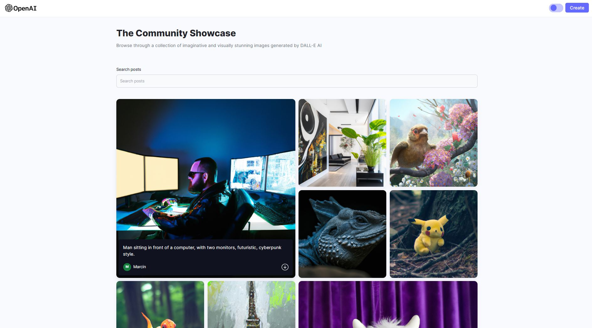
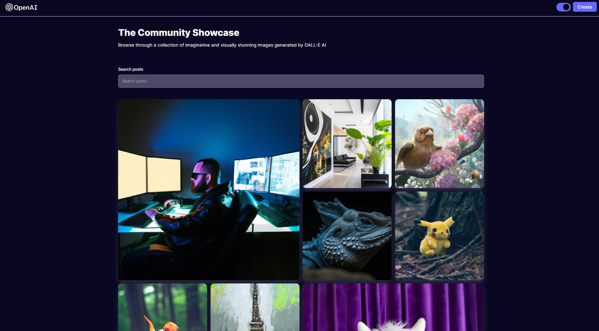

# Welcome to Dalle_clone!

## 💡 Concept
A fullstack (MERN) web app based on OpenAI API, allowing to create, post and download AI generated (DALL-E) pictures based on text prompts.
 
## 🔍 Project overview 
The app allows users to create AI generated pictures (1024x1024) based on text prompts. On homepage there is a display of all generated pictures. From homepage user can download any picture. 
On "create-post" page user can create picture based on custom prompts or choose a random prompt from a ready base of sample prompts.
Pictures are stored in cloudinary account and MongoDB stores data to post and get the prompts.
The app has light and dark mode, depending on user preference.

## 📦 Tech stack:
- Vite
- MongoDB
- Express.js
- React with Hooks
- Node.ks
- Tailwind css
- OpenAI API
- Cloudinary

 
## 💻 Demo

Click the link and check the demo app: [Dalle-link](https://ms-dalle.netlify.app/)

## 💾 Installation
# /server:
- install modules (CLI):  "npm install"
- add .env file and to add following data of your own:
  - OPENAI_API_KEY="your_key"
  - MONGODB_URL="your_mongodb_link"
  - CLOUDINARY_CLOUD_NAME="cloud_name"
  - CLOUDINARY_API_KEY="your_key"
  - CLOUDINARY_API_SECRET="secret"
- run local server (CLI):  "npm run dev"

# /client:
- install modules (CLI):  "npm install"
- change both fetch addresses (in both src/pages/Home.jsx and src/pages/CreatePost.jsx) to localhost 
- run local server (CLI):  "npm run dev"

## ☎️ Contact
In case of any comments or advice, You can e-mail me or use Issues :)

## 🧙‍♂️ Author
- GitHub - [Marcin Suski](https://github.com/marcinsuski)
- LinkedIn - [marcin-suski](https://www.linkedin.com/in/marcin-suski/)
- Porftolio - [marcinsuski.pl](https://marcinsuski.pl)
